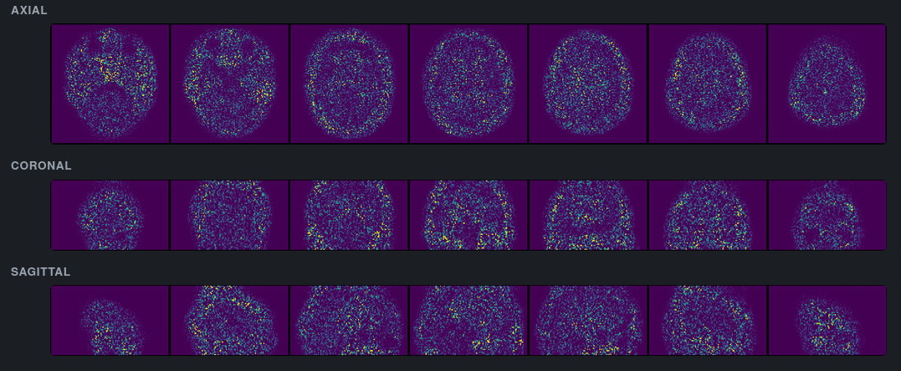

# QC

The per-subject HTML QC report is generated when running **dwi-qc**. This page describes what each section of the report contains and what to look for.

---

## Overview

This step can be run after **dwi-preproc** or **dwi-tracto**. It collects outputs from multiple pipeline stages and assembles them into a single self-contained HTML report per subject (and per session, if applicable).

**Output:** `<outputdir>/dwi-preproc/<subject>[_<session>]_qc.html`

---

## Running the QC step

::::{tab-set}

:::{tab-item} Docker
```bash
docker run --rm \
  -v /host/path/to/bids:/bids \
  -v /host/path/to/output:/derivatives \
  -v /host/path/to/work:/work \
  -v /host/path/to/spec.json:/spec/spec.json \
  cvriend/tractoprep{{RELEASE_TAG}} \
  dwi-qc /spec/spec.json
```
:::

:::{tab-item} Podman
```bash
podman run --rm \
  -v /host/path/to/bids:/bids \
  -v /host/path/to/output:/derivatives \
  -v /host/path/to/work:/work \
  -v /host/path/to/spec.json:/spec/spec.json \
  cvriend/tractoprep{{RELEASE_TAG}} \
  dwi-qc /spec/spec.json
```
You can add a `:Z` suffix to relabel bind mounts for
SELinux-enforcing hosts — omit it if not applicable.
:::

:::{tab-item} Apptainer
```bash
apptainer run --cleanenv \
  --bind /host/path/to/bids:/bids,/host/path/to/output:/derivatives,/host/path/to/work:/work \
  tractoprep_{{RELEASE_TAG}}.sif dwi-qc /spec/spec.json
```
:::

::::

```{note}
To run QC for **all subjects** found under `<outputdir>/dwi-preproc`, add the **--all** flag.
```

---

## Report sections

The report is modular — sections are only included if the corresponding output files exist. The order in the report follows the pipeline stages.

### 1. b-value consistency check (banner)

A top-of-page banner reports whether the `.bval` file is consistent with the DWI series. Mean intra-cerebral signal should decrease monotonically with increasing b-value. If it does not, the bvals file may be mismatched with the acquired series.

| Status | Meaning |
|--------|---------|
| ✓ Pass | Mean signal decreases with b-value across all shells |
| ✗ Fail | One or more higher-b shells show unexpectedly higher signal than a lower-b shell |
| ⚠ Inconclusive | Only one b-value present — nothing to compare |
| ⚠ Error | bvals file not found or does not match the number of volumes |

**What to check:** A `Fail` status is a strong signal that the wrong `.bval` file is being used, or that volumes are in the wrong order. Expand the details to see the per-shell signal table and which shells violate the expected ordering.

---

### 2. Residuals Map

**Source:** `dwidenoise` (MRtrix3, MP-PCA denoising)
**File:** `*_space-dwi_(dir-PE_)desc-residuals_dwi.nii.gz`

Displays the spatial distribution of the residuals estimated during MP-PCA denoising, shown as a mosaic of axial, coronal, and sagittal slices.

**What to check:**
- The residuals should be relatively random and uniform across the brain and not follow anatomical boundaries.


::::{grid} 1
:::{grid-item-card} ✅ Residuals show a uniform pattern and do not follow anatomical boundaries

::::

---

### 3. Eddy Current & Motion Correction

**Source:** FSL `eddy` + `eddy_quad`
**Files:** `qc.json`, `*.eddy_movement_rms`, `*.eddy_outlier_report`, CNR maps

This section contains several sub-components:

#### Summary statistics

| Metric | Flag threshold |
|--------|---------------|
| Mean absolute motion (mm) | > 1.0 mm |
| Mean relative motion (mm) | > 0.5 mm |
| Outlier slices (%) | > 5% |

``` {note}
Cards are highlighted red if thresholds are exceeded (but should not necessarily be used as a marker for exclusion!).
```

#### Volume-to-volume motion plot

Absolute and relative RMS displacement across volumes. Large spikes indicate volumes with significant motion.


::::{grid} 1
:::{grid-item-card} Example plot

::::

#### Outlier slice scatter plot

Each point represents a slice flagged as an outlier by eddy's outlier detection. Point size and colour indicate severity (mean squared standard deviations off).

#### Outlier volume inspection

For each volume containing outlier slices, a toggle allows comparison of the raw (pre-eddy) and eddy-processed volume side by side. Use this to spot volumes with residual (motion) artefacts (visible as so-called *Venetian blinds*) after preprocessing that warrant deletion using the `dwi-dropvols.py` helper script before continuing with `dwi-tracto`. 


::::{grid} 1
:gutter: 3
:class-container: sd-w-75

:::{grid-item-card} ✅ Correctly cleaned artefacts > no volume deletion / exclusion required.

:::

:::{grid-item-card} ❌ artefact not fixed >  volume deletion / exclusion required.

:::

::::

```{note}
If more than 10% of total volumes contains  artefacts that remain after preprocessing it is better to exclude the scan from the analyses.
```

---
#### eddy_quad summary images

Average b0 and per-shell average DWI images, plus voxel-wise SNR (b0) and CNR maps for each shell, as generated by `eddy_quad`.

**What to check:**
- Motion > 1 mm absolute or > 0.5 mm relative warrants closer inspection.
- Outlier % > 5% may indicate signal dropout or severe motion in specific volumes.
- CNR maps should show reasonable contrast in white matter.

---

### 4. Susceptibility Distortion Correction (topup)

**Source:** FSL `topup`
**Files:** pre- and post-correction EPI volumes, acquisition parameters, fieldmap

A toggle switches between the EPI image **before** and **after** topup correction, for the phase-encode direction matching the DWI acquisition. An optional overlay shows the off-resonance fieldmap (Hz) on the corrected image.


::::{grid} 1
:::{grid-item-card} ✅ Succesful SDC

::::


**What to check:**
- Geometric distortions (typically in the anterior–posterior direction) should be substantially reduced after correction.
- The fieldmap overlay should show a smooth, anatomically plausible distortion pattern.
- If the PE direction match is uncertain, a warning is shown and the first available PE direction is used.

```{todo}
Add example figure: EPI before and after topup correction.
Place image at ``docs/source/_static/qc_topup_example.png`` and replace this block with a ``{figure}`` directive.
```

---

### 5. Brain Mask

**Source:** brain extraction applied to the nodif (b0) image
**Files:** `*_space-dwi_desc-nodif_dwi.nii.gz`, `*_space-dwi_desc-brain_mask.nii.gz`

The brain mask boundary is overlaid as a red contour on the nodif image in axial, coronal, and sagittal views. Summary statistics show mask volume (voxels) and coverage percentage.

**What to check:**
- The mask should tightly follow the brain boundary without large inclusions of non-brain tissue or missing brain regions.
- Pay particular attention to frontal and temporal poles, cerebellum, and brainstem.

::::{grid} 1
:::{grid-item-card} ✅ Correct brain masking

::::

---

### 6. T1–DWI Coregistration

**Source:** registration of FreeSurfer T1w to DWI space
**Files:** `*_space-dwi_res-FS_desc-brain_T1w.nii.gz`, nodif template, optional `*_desc-5tt-hsvs_vis.nii.gz`

An interactive slider transitions between the T1w image and the nodif (b0) image in DWI space. An optional checkbox overlays the 5-tissue-type (5tt) segmentation from `5tt2vis`.

**What to check:**
- Sulcal and gyral patterns in T1w should align with the brain boundary visible in the nodif image.
- The 5tt overlay should show tissue boundaries (WM/GM/CSF) that are anatomically consistent with the DWI space.
- Misalignment is most visible at the brain boundary, ventricles, and in deep structures.

::::{grid} 1
:gutter: 3
:class-container: sd-w-75

:::{grid-item-card} ✅ Correct registration

:::

:::{grid-item-card} ❌ Incorrect registration

:::

::::

---

### 8. Tractogram

**Source:** MRtrix3 whole-brain tractography (iFOD2)

Up to 20,000 randomly sampled streamlines are rendered as RGB-coloured lines (coloured by local fibre orientation: R=left–right, G=anterior–posterior, B=superior–inferior) overlaid on a T1w MIP in axial, coronal, and sagittal views.

**What to check:**
- Streamlines should cover the whole brain bilaterally.
- Major tracts (corpus callosum, corticospinal tract, arcuate fasciculus) should be visible.
- Sparse coverage or asymmetric tracking may indicate a masking, registration, or FOD estimation problem.

::::{grid} 1
:::{grid-item-card} ✅ Correct tractogram

::::

---

### 9. Connectivity Matrix

**Source:** MRtrix3 `tck2connectome`
**File:** `*_atlas-<atlas>_desc-streams_connmatrix.csv`

A heatmap of the normalised streamline connectivity matrix. A disconnected node check reports nodes with zero streamlines to or from all other nodes.

**What to check:**
- The matrix should show a structured pattern consistent with known brain connectivity (e.g., strong ipsilateral connections (= brighter colors in upper left and lower right quadrant), bilateral homotopic connections (= visible as a fainter off-diagonal line)).
- Disconnected nodes (shown in red) indicate parcellation regions that received no streamlines — this may reflect registration issues, a region outside the brain mask, or a region too small for the tractography algorithm.

::::{grid} 1


::::

---

## Output files used by the QC report

| Flag | File pattern |
|------|-------------|
| `--bval-check-bvals` | `<bidsdir>/<subj>/dwi/<subj>_dwi.bval` |
| `--noise` | `dwi-preproc/<subj>/qc/*_desc-noise_dwi.nii.gz` |
| `--topup-before` | `dwi-preproc/<subj>/fmap/*_desc-4topup_epi.nii.gz` |
| `--topup-after` | `dwi-preproc/<subj>/fmap/*_desc-unwarped_epi.nii.gz` |
| `--topup-fieldmap` | `dwi-preproc/<subj>/fmap/*_desc-topup_fieldmap.nii.gz` |
| `--eddy-json` | `dwi-preproc/<subj>/qc/qc.json` |
| `--eddy-rms` | `dwi-preproc/<subj>/qc/*_desc-preproc.eddy_movement_rms` |
| `--eddy-outliers` | `dwi-preproc/<subj>/qc/*_desc-preproc.eddy_outlier_report` |
| `--eddy-cnr-maps` | `dwi-preproc/<subj>/qc/*_label-cnr-maps_desc-preproc_dwi.nii.gz` |
| `--brainmask-nodif` | `dwi-preproc/<subj>/dwi/*_desc-nodif_dwi.nii.gz` |
| `--brainmask-mask` | `dwi-preproc/<subj>/dwi/*_desc-brain_mask.nii.gz` |
| `--reg-t1w-dwi` | `dwi-preproc/<subj>/anat/*_space-dwi_res-FS_desc-brain_T1w.nii.gz` |
| `--reg-5ttvis` | `dwi-preproc/<subj>/qc/*_desc-5tt-hsvs_vis.nii.gz` |
| `--response-voxels` | `dwi-tracto/<subj>/qc/*_desc-response_voxels.nii.gz` |
| `--tract-tck` | `dwi-tracto/<subj>/qc/*_tracto-100k.tck` |
| `--connectivity-matrix` | `dwi-tracto/<subj>/conn/*_atlas-<atlas>_desc-streams_connmatrix.csv` |

Missing files are silently skipped; the corresponding section is omitted from the report.

---

## Acknowledgement

QC metrics and eddy summary images are generated with FSL's `eddy_quad` (EDDY QC toolbox). Tractography and connectivity outputs use MRtrix3. Denoising uses the MP-PCA implementation in MRtrix3 `dwidenoise`.
